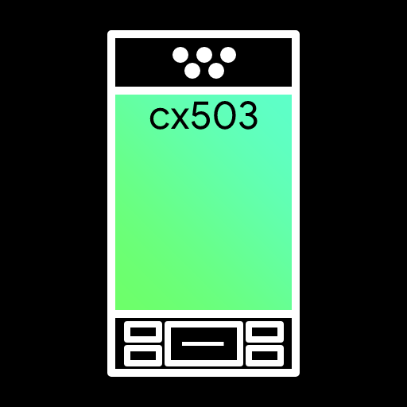

# cx503

## О проекте
Проект кастомизации прошивки плеера x-cube x503 и добавления кастомных тем

## Инструкция
Для использования нужно чуть-чуть терпения, питон 3 (тестировал на 3.10, по идее должно работать и на 3.11) и пара библиотек.

Рекомендую сразу сделать бекап на всякий.

- Скачать репозиторий
- Установить `numpy`, `pillow` и `colorama`
- Начать изменять что нравится в папке `assets` 
  Прим. прозрачный цвет в большинтве файлов - #ff00ff (255, 0, 255)
- Когда закончите запустите `main.py`
- Если все прошло без ошибок (`FE` на красном фоне), перезагрузитесь в режим прошивки на плеере, выключив его, и включив, не отпуская кнопки после надписи loading, держим до победного
- Когда высветится синий экран, подрубаем плеер к компу, жмем два раза (не быстро) `Play`
- На компьютере подключится 3 раздела
- Ищем ~14mb раздел, с него удаляем AkResData.Bin и копируем с папки с проектом (ИЗ ПАПКИ НЕ УДАЛЯТЬ! ПРОГРАММА МОДИФИЦИРУЕТ СУЩЕСТВЮЩИЙ, НЕ СОЗДАЕТ НОВЫЙ)
- Отключаем от компа, скрепкой тыкаем в дырку сверху с подписью `Reset` и врубаем.

Если все прошло, то вуа-ля! Вы теперь имеете прошивку с темой!

В папке `assets` тема сделанная мною.

Have fun =')
